# KUVPN v3.0.0

KUVPN is a VPN client for Koç University that automates the Microsoft Azure AD / MFA browser login to retrieve a DSID cookie, then hands off to OpenConnect to establish the VPN tunnel.

> **KUVPN** is the graphical app (system tray, GUI window).
> **kuvpn** is the command-line tool (run `kuvpn` in a terminal).
> Both connect to the same VPN — pick whichever fits your workflow.

---

## Documentation

<table>
<tr>
<td align="center" width="33%">

### [Install](https://github.com/ealtun21/kuvpn-actions#installation)
Get up and running on any platform

</td>
<td align="center" width="33%">

### [GUI Docs](https://github.com/ealtun21/kuvpn-actions/blob/main/docs/gui.md)
Graphical app — KUVPN

</td>
<td align="center" width="33%">

### [CLI Docs](https://github.com/ealtun21/kuvpn-actions/blob/main/docs/cli.md)
Command-line tool — kuvpn

</td>
</tr>
</table>

---

## Installation

**Linux:**

```bash
wget -qO- https://raw.githubusercontent.com/ealtun21/kuvpn-actions/main/install.sh | bash
```

**macOS:**

```bash
curl -sSfL https://raw.githubusercontent.com/ealtun21/kuvpn-actions/main/install.sh | bash
```

The script will ask what to install (GUI, CLI, or both), set up your PATH, and check for OpenConnect.

**Windows** (run in PowerShell):

```powershell
irm https://raw.githubusercontent.com/ealtun21/kuvpn-actions/main/install.ps1 | iex
```

Or download and run [`KUVPN-Setup-windows-x86_64.exe`](https://github.com/ealtun21/kuvpn-actions/releases/latest) manually from the Releases page.

<details><summary>Non-interactive flags (for scripting / automation)</summary>

```bash
# Linux — install both
wget -qO- https://raw.githubusercontent.com/ealtun21/kuvpn-actions/main/install.sh | bash -s -- --all

# Linux — GUI only
wget -qO- https://raw.githubusercontent.com/ealtun21/kuvpn-actions/main/install.sh | bash -s -- --gui

# Linux — CLI only
wget -qO- https://raw.githubusercontent.com/ealtun21/kuvpn-actions/main/install.sh | bash -s -- --cli

# macOS — install both
curl -sSfL https://raw.githubusercontent.com/ealtun21/kuvpn-actions/main/install.sh | bash -s -- --all
```

</details>

## Features

- Modern GUI with system tray and status icons
- Auto-shows the window when input or MFA is required
- Full Auto, Visual Auto, and Manual login modes
- Headless (background) browser for seamless authentication
- Session persistence — stays logged in across reconnects
- Automatic tunnel reconnect (up to 3 attempts) with a short delay between each attempt
- Connection history with session durations and reconnect tracking
- Full and Manual tunnel modes (Full routes all traffic; Manual accepts a custom vpnc-script)
- Persistent 10 MB rolling log file for post-mortem debugging
- Broken-tunnel detection: monitors the actual VPN interface, not just the process
- Static CLI binary, no runtime dependencies

---

## Screenshots

### Graphical Interface (KUVPN)

| Main Window | History | Settings |
|:---:|:---:|:---:|
| 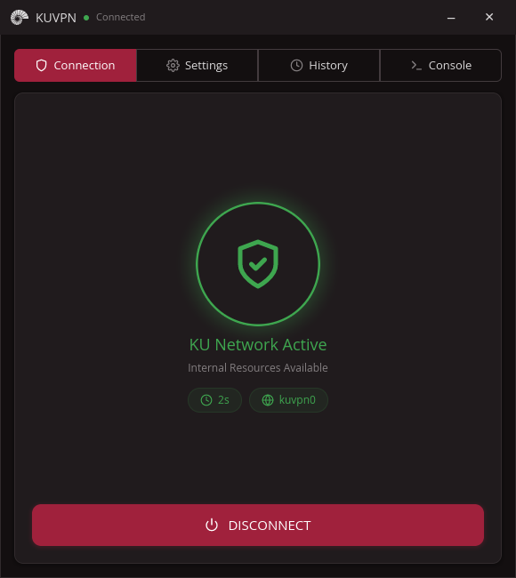 | 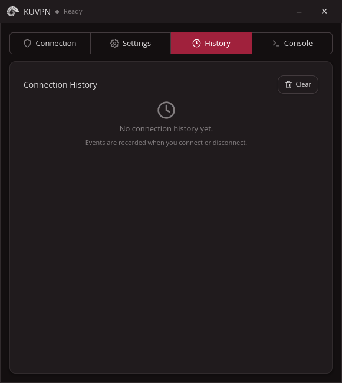 | 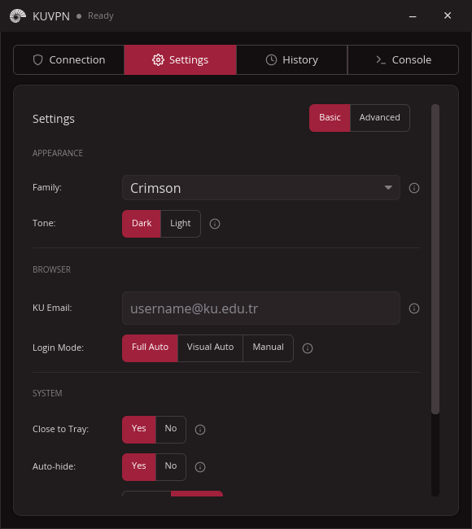 |

| MFA Authentication | Email Automation | Live Logs |
|:---:|:---:|:---:|
| 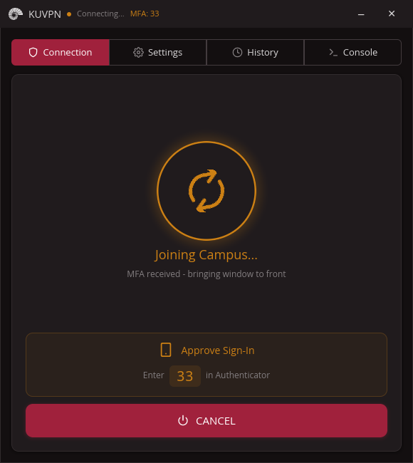 | 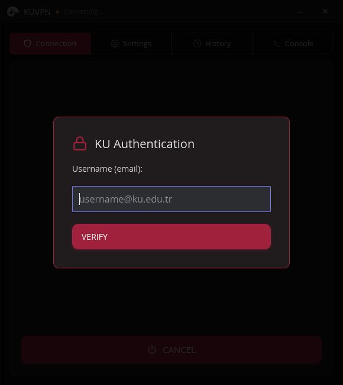 | 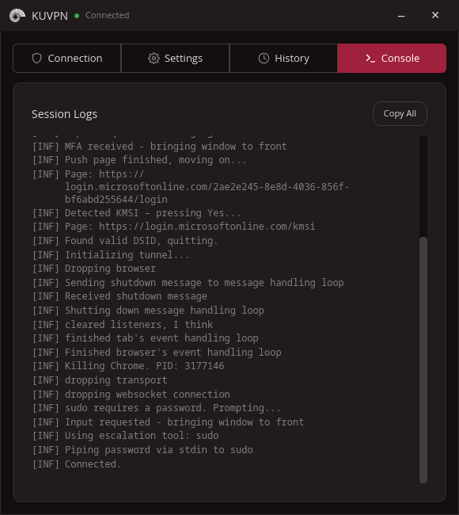 |

### Command Line Interface (kuvpn)

| Connected | Connecting | MFA Prompt |
|:---:|:---:|:---:|
| 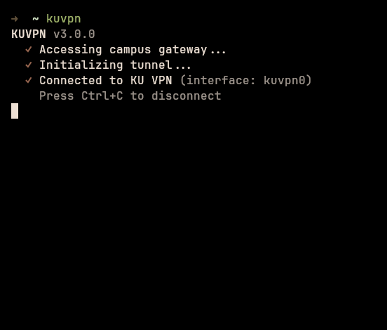 | 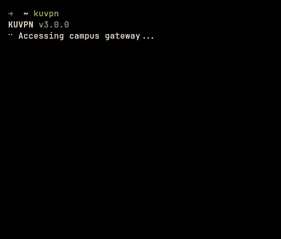 | 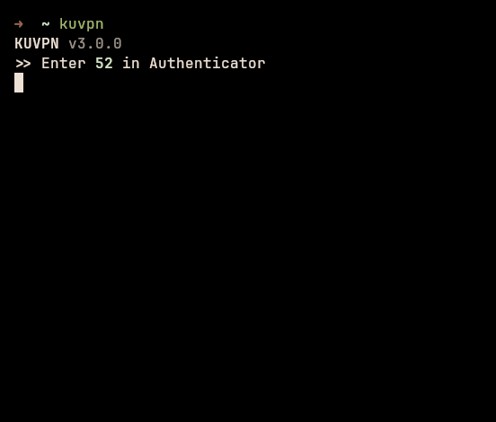 |

| History | Session Management | Disconnected |
|:---:|:---:|:---:|
| 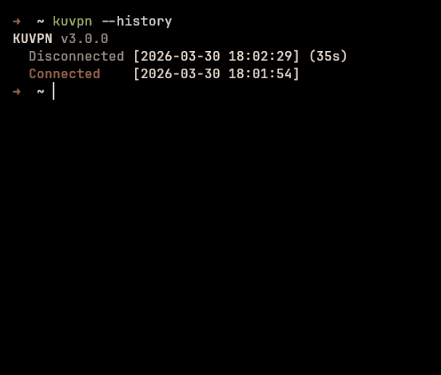 | 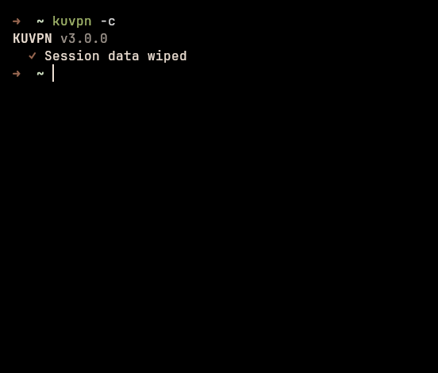 | 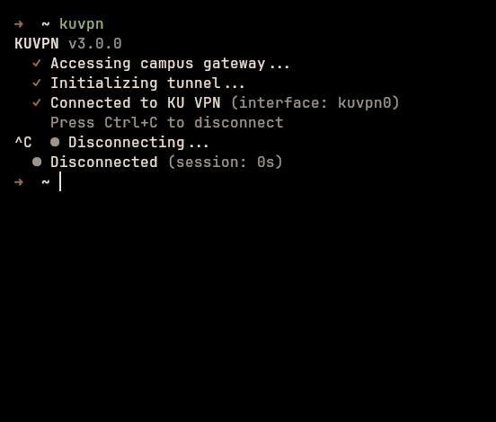 |

### Themes

KUVPN features 10 unique color families, each with Light and Dark modes (20 themes total).

| | Dark | Light |
| --- | :---: | :---: |
| **Crimson (Default)** | 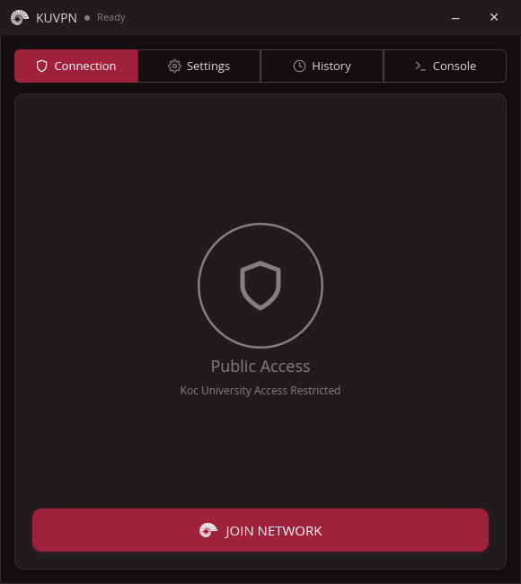 | 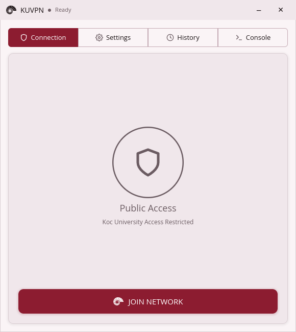 |
| **Slate** |  |  |
| **Ocean** | 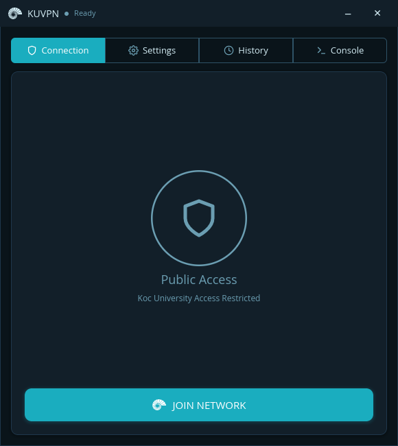 |  |
| **Forest** | 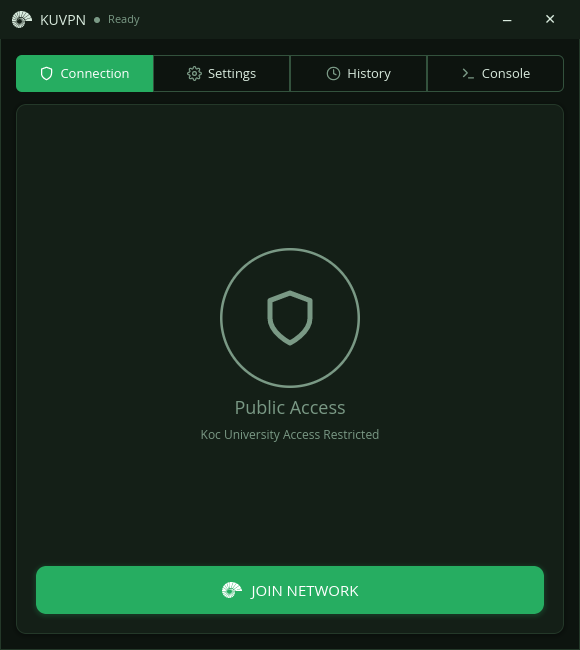 | 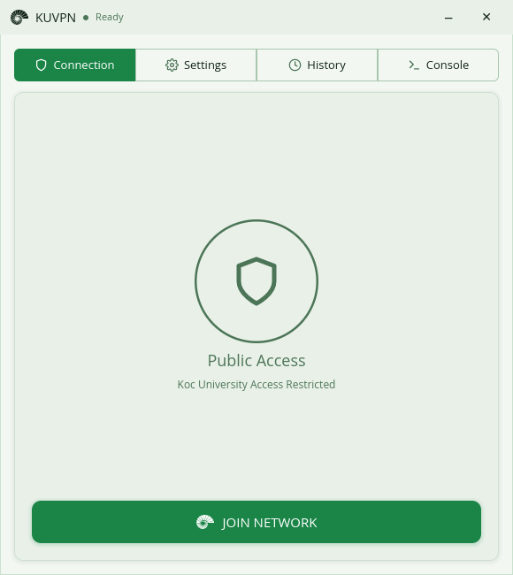 |
| **Rose** | 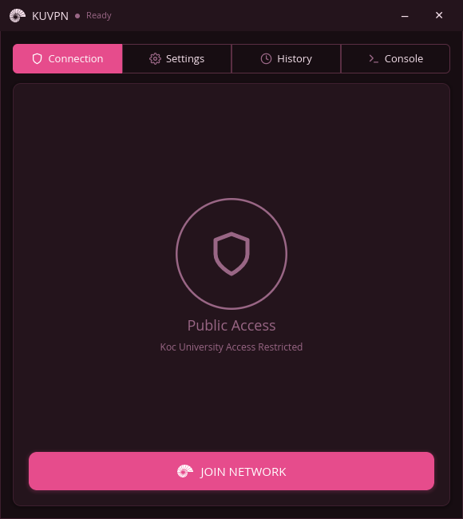 |  |
| **Violet** |  | 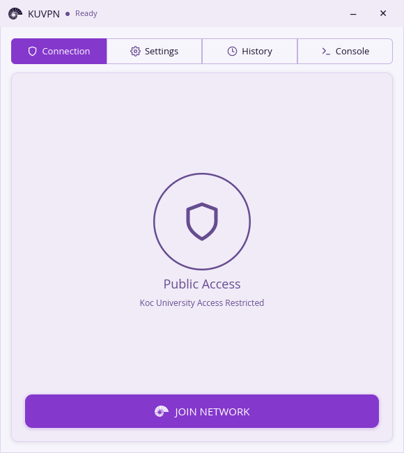 |
| **Ember** | 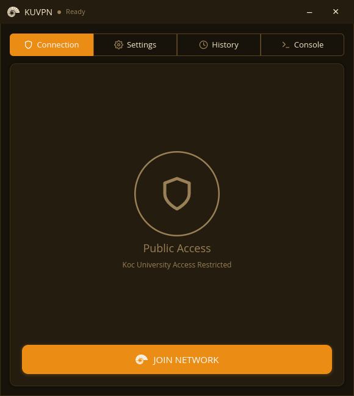 | 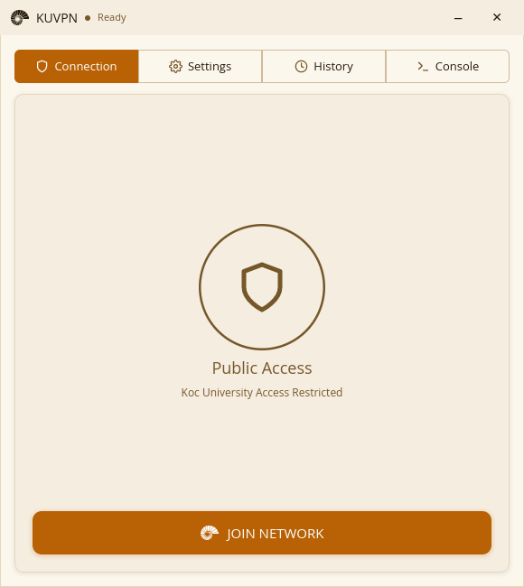 |
| **Frost** | 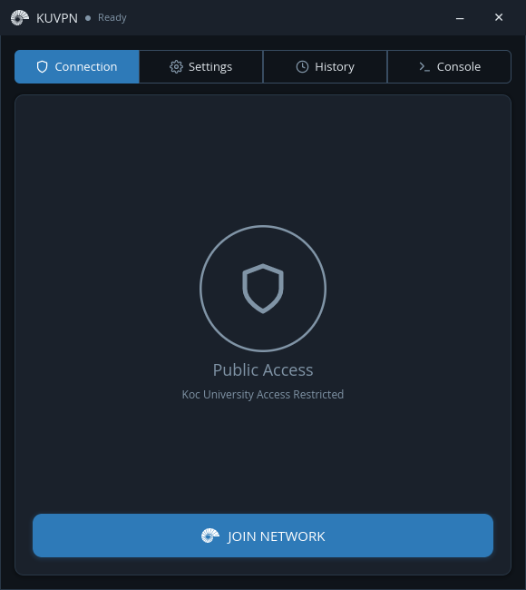 | 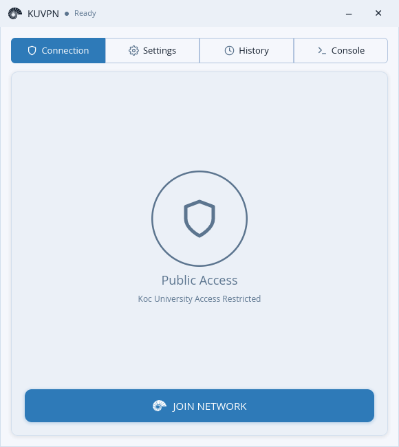 |
| **Sand** | 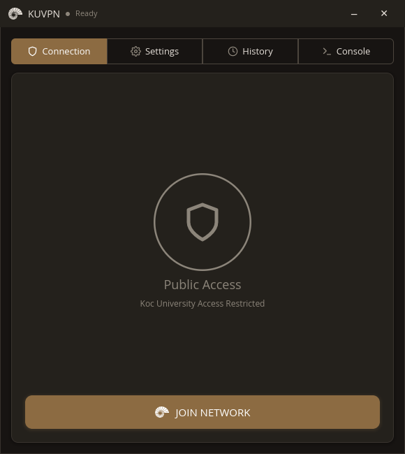 |  |
| **Pebble** | 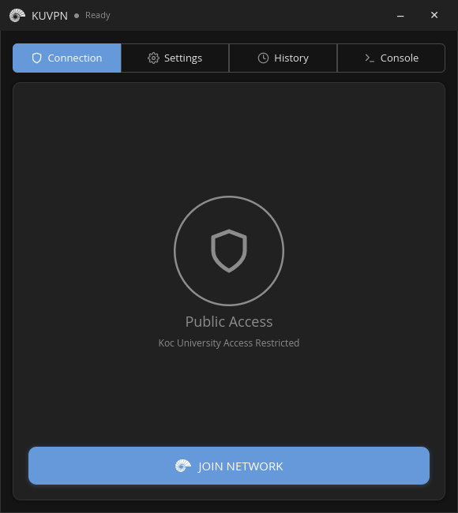 | 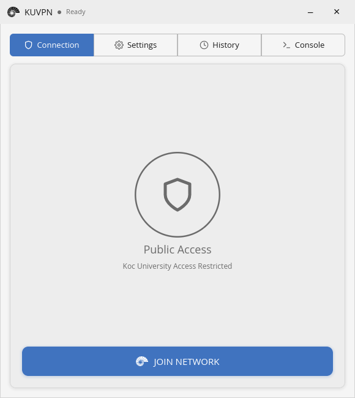 |

---

## License

MIT — see [LICENSE](LICENSE).

## Contributing

Issues and pull requests are welcome.
